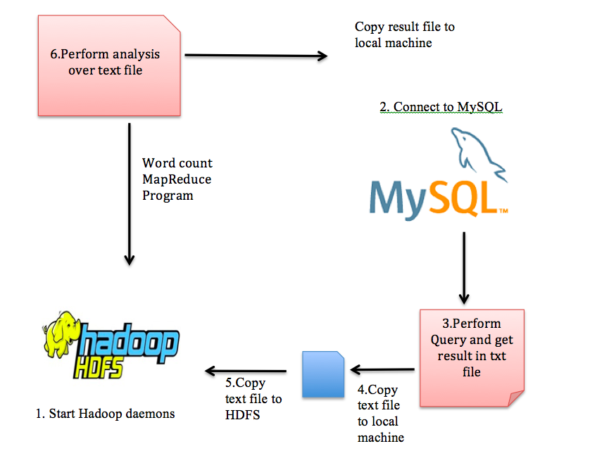

#**An experimental study on Hadoop and MySQL integration**

##Introduction

My project entitled “An experimental study on Hadoop and MySQL integration”. While working on my in class paper presentation on “MapReduce simplified data processing on large cluster” I came to know about MapReduce as one of the major components of Hadoop from programming aspect. I found Hadoop and big data processing is fascinating as Hadoop is the opposite of any relational database. Unlike MySQL where we have a set of tables and indices, Hadoop works with a set of text files, as we all have learnt about MySQL and other relational databases for querying and storing data in class and Hadoop is different so; I thought to integrate Hadoop and MySQL so we can transfer data from MySQL to Hadoop and vice versa for better performance. My project goal is to convert MySQL query results into txt files and transfer into Hadoop file system where many different kind of analysis could be performed on the data on a cluster hence increasing the performance in short period of time, For my project I am going to take some data from MYSQL and try to perform secondary analysis (Word Count) on the exported data. 

*I Intstalled and Configure Hadoop on Pseudo-distributed mode*

##Check the hadoop daemons are running:
Browse the web interface and check the namenode and resource manager:

http://localhost:50070/dfshealth.html#tab-overview
http://localhost:8088/

##**Integration MySQL and Hadoop WorkFlow:**

##**Basic commands of HDFS:**
**ls command :** Display the list of files and directories in HDFS
Syntax: Hadoop dfs –ls /

**mkdir command :** Create the directory in hdfs
Syntax: hdfs dfs –mkdir /directoryname  

**put command :** Copy single source, or multiple srcs from local file system to the destination file system. 
Syntax: hdfs fs -put <localsrc> ... <dst>


**get command :** Copy files from hdfs to the local file system.

Syntax: hadoop fs -get <src> <localdst> 

**rm command :** Remove the file from HDFS
Syntax:hdfs dfs –rm /path/to/fileinhdfs 

**rmr command :** Remove the directory from HDFS
Syntax:hdfs dfs –rmr  /path/to/directoryinhdfs

**touchz command :** create a file in HDFS with file size 0 bytes
Syntax:hdfs dfs –touchz /directory/filename 

##**Execution of Hadoop and MySQL integration**

$ sh cmd.sh “sql query” dirlist

